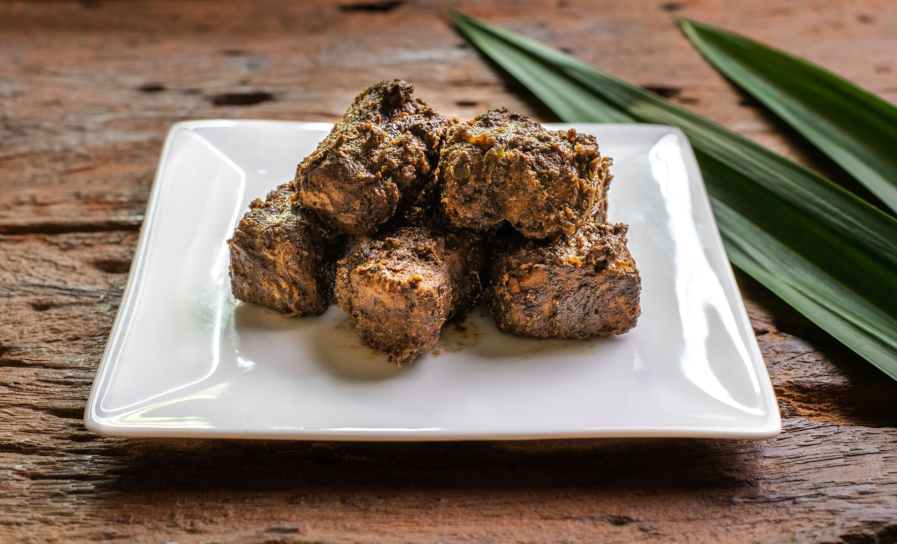
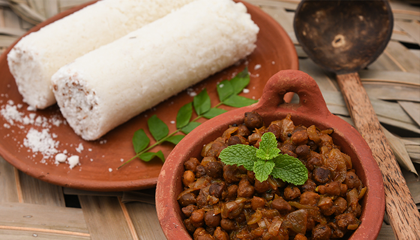
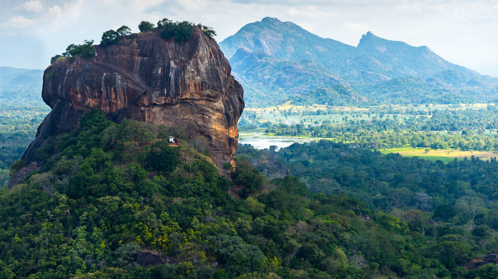
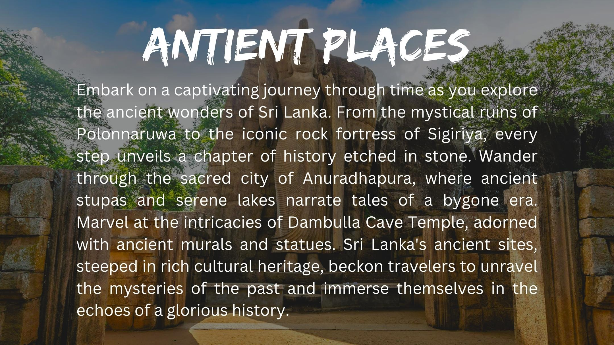
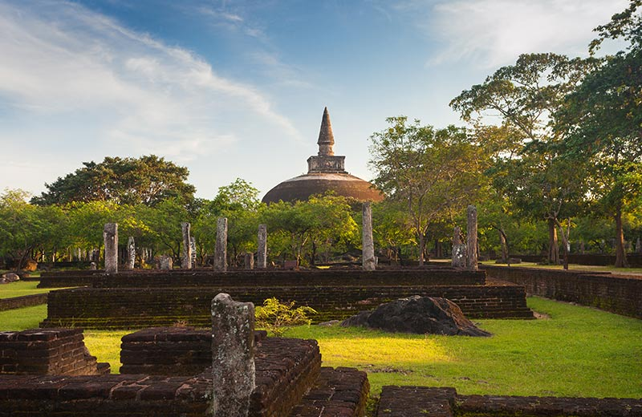

# WADCW

                                              Submitted by
                             B M L N N Karunathilaka       KUDSE222F-001
                             M W T S D Dissanayaka         KUDSE222F-008
                             D H D Indrawansha             KUDSE222F-017
                             P M S Shashikala              KUDSE222F-015

                             Introduction:
Sri Lanka is renowned for its rich cultural heritage,The warm hospitality of the locals, coupled with delicious cuisine, contributes to a memorable cultural experience. Sri Lanka's festivals, such as the Esala Perahera in Kandy, add vibrant colors and traditional rituals to the cultural tapestry.
Whether you seek historical wonders, natural landscapes, or a taste of local life, Sri Lanka offers a captivating blend of culture and tourism.

Website Development Objectives:
⦁	Showcasing Cultural Richness:
colorful festivals such as Sinhala and Tamil New Year, and the unique Sinhala and Tamil scripts adorning ancient temples and artifacts. Additionally, the island's culinary delights, featuring rice and curry dishes, reflect the diversity of flavors in Sri Lankan cuisine , Leveraging Bootstrap components.

⦁	Promoting Natural Beauty:
Highlighting Sri Lanka's natural beauty for traditional events, foods, and places can be achieved through vibrant storytelling, captivating visuals, and engaging content. Share narratives about the significance of traditional events, showcase the richness of local cuisines, and explore the allure of iconic places. Utilize social media platforms, create visually appealing content, and collaborate with influencers to reach a broader audience. Emphasize the unique cultural aspects that make Sri Lanka a distinctive and enchanting destination, fostering a sense of pride and appreciation for the country's natural treasures. This Utilizing Bootstrap's responsive design capabilities, the website will showcase Sri Lanka's diverse

⦁	Interactive Maps and Itineraries:
The inclusion of Bootstrap features will facilitate the creation of interactive maps, highlighting key .
tourist destinations and suggesting itineraries. This dynamic element will empower users to customize. 
their travel plans, encouraging exploration of different regions within Sri Lanka.

⦁	Local Cuisine and Experiences:
The website will boast sections dedicated to the vibrant local cuisine and unique cultural experiences.    Leveraging Bootstrap's card components, enticing food options and cultural events will be presented, enticing users to immerse themselves in the diverse flavors and traditions of Sri Lanka.

⦁	User Engagement and Social Sharing:
To foster user interaction, Bootstrap forms and modals will be implemented to gather feedback, inquiries, and suggestions. Additionally, social media sharing buttons will be seamlessly integrated, encouraging visitors to share their excitement about their upcoming Sri Lankan adventure and creating a buzz across various platforms.

In summary, this project aims to create a dynamic, visually stunning website that not only showcases the cultural and natural treasures of Sri Lanka but also actively engages potential tourists, inviting them to plan and share their unique Sri Lankan experiences. Through thoughtful use of Bootstrap components, the website will cater to the diverse interests and preferences of our target audience, making it a valuable asset in Sri Lanka's efforts to become a premier tourist destination

Head section

<!DOCTYPE html>
<html lang="en">
<head>
  <title>Ceylon Beauty</title>
  <link rel="icon" type="image/x-icon" href="1icon.jpg">
  <link rel="icon" type="image/x-icon" href="Artboard 1-100.jpg">
  <meta charset="utf-8">
  <meta name="viewport" content="width=device-width, initial-scale=1">
  <link href="https://cdn.jsdelivr.net/npm/bootstrap@5.3.2/dist/css/bootstrap.min.css" rel="stylesheet">
  <link rel="stylesheet" href="https://www.w3schools.com/w3css/4/w3.css">
  
</head>

Body section
Header Section

<body style="background-image: url(Sri\ Lanka\ Tourism\ \(1\).jpg); background-repeat: no-repeat;background-size: cover; background-attachment: fixed; ">
  <header>
    <nav class="navbar navbar-expand-sm justify-content-center navbar-dark bg-dark">
      <a class="navbar-brand" href="my1.html" style="position: relative; right: 400px;"><b>Ceylon Beauty</b></a>
        <ul class="navbar-nav">
          <ul class="navbar-nav">
            <li class="nav-item">
              <a class="nav-link" href="my1.html">HOME</a>
            </li>
            <li class="nav-item">
              <a class="nav-link" href="https://maps.app.goo.gl/KAHyZzoScvBodD686">GO TO MAP</a>
            </li>
            <li class="nav-item">
              <a class="nav-link" href="about1.html">ABOUT SRI LANKA</a>
            </li>
            <li class="nav-item">
                <a class="nav-link" href="feed.html">FEEDBACKS</a>
            </li>
        </ul>
      </nav>
      
  </header>

Welcome Section
<section id="welcome">
    <button type="button" class="btn btn-outline-light " style="width: 30%; padding-top: 10px; padding-bottom: 10px; 
    position: relative; top: 480px; left: 500px;">
    <a href="my22.html" class="nav-link">Start Travel</a></button>
  </section>


Feedback Section
<section id="feedback">
    

        <h2><b>Give Your Feed</b></h2>
        <form action="/action_page.php">
          

            <label for="email">Email:</label>
            <input type="email" class="form-control" id="email" placeholder="Enter email" name="email">
          

          

            <label for="feed">Your Feed</label>
            <input type="text" class="form-control" id="fd" placeholder="Enter feed" name="pswd">
          

          

            <label class="form-check-label">
              <input class="form-check-input" type="checkbox" name="come again">Re You Come Again?
            </label>
          

          <button type="submit" class="btn btn-success">Submit</button>
        </form>
      

  </section>
  
Welcome To Home Section

<section id="welhometohome">
      

        <h1 style="opacity: 1.0;"><b>Why you shoud choose Sri Lanka?</b></h1>
        
If golden beaches, rising waves, misty mountains, mighty elephants, stealthy leopards, giant whales, a majestic past,  lovely tea and warm smiles could sum up a country, that would be Sri Lanka. 


          With many sites and scenes bottled up in to a small island, a traveller could be riding the waves in the dawn and  admiring the green carpeted mountains by dusk. Travel destinations in Sri Lanka provide an array of holiday experience from sun kissed  beach holidays to a marathon of wildlife watching, adrenaline pumping adventure sports and pilgrimage to some of the oldest cities in the world. 
          
          The smiles and hospitality of Sri Lanka are world famous and so are its spicy food, exotic fruits,  and an array of sweetmeats found nowhere in the world. With so many cultures living next to each other life in Sri Lanka continues among a  series of festivities throughout the year, an ideal recipe for fun and leisure.

      



      

        <a href="foods.html" class="nav-link"><h1>Traditional Foods</h1></a>
        
Lets try ceylone taste...

      



      

        <a href="event.html"class="nav-link"><h1>Traditional Events</h1></a>
        
Lets try ceylone taste...

      



      

        <a href="beautiful places.html" class="nav-link"><h1>Beautiful Places</h1></a>
        
Lets try ceylone taste...

      



      

        <a href="antientp.html" class="nav-link"><h1>Antient Places</h1></a>
        
Lets try ceylone taste...

      

    </section>

Welcome To Home Footer
<footer id="welcometohomee" style="margin-top: 5px; margin-bottom: 5px;">
      

      <ul style="color: aliceblue;">
        <li ><a href="booking.com" class="nav-link">Booking Hotels</li>
        <li><a href="https://visitslk-online.com" class="nav-link">Apply Your Visa Online</li>
        <li><a href="https://www.ceylotravels.com/" class="nav-link">Supporters Your Traveling</li>  
      </ul>
      

    </footer>

 Food Section

<section id="food">

    

    

    
 Embark on a culinary odyssey in Sri Lanka, where the heart of every meal beats to the rhythm of rice and curry.
        This traditional fare is not just a meal; it's a cultural experience that encapsulates the essence of the island's
        diverse flavors and rich heritage. Picture fragrant basmati rice, perfectly cooked and served alongside an array of
        curries bursting with spices – from the fiery kick of chicken curry to the aromatic blend of dhal curry. The symphony
        of flavors extends further with accompaniments like sambols, pickles, and crispy papadums. Each region adds its unique touch,
        making every plate a mosaic of culinary delights. Beyond its gastronomic allure, Sri Lankan rice and curry weave a narrative
        of community, family, and shared traditions, making it a must-experience journey for any traveler eager to taste the soul of 
        this enchanting island.
    

    <h3><a href="https://maps.app.goo.gl/L1HpgA1uL1Gs2ChW7"class="nav-link" ><h3 style="color: aliceblue; position: relative; left: 650px; bottom: 50px;">Click To Go Map for rice and curry famouse area</h3></a></h3>

    

    
 Indulge your senses in the culinary treasures of Sri Lanka, where the exquisite Fish Ambulthiyal Curry beckons as a culinary masterpiece.
        This traditional dish, hailing from the coastal regions, is a symphony of flavors that captivates every traveler's palate.
        Prepared with succulent chunks of fish marinated in a blend of aromatic spices, including goraka (a souring agent),
        dried chillies, and black pepper, the Ambulthiyal curry is a culinary celebration of the island's rich heritage. Slow-cooked to perfection,
        the dish offers a unique balance of tanginess and spice, leaving an indelible mark on your taste buds. As you savor this delicacy,
        you not only partake in a culinary adventure but also connect with the vibrant coastal culture, making your journey through Sri Lanka
        an immersive and flavorful experience.
    

    <h3><a href="https://maps.app.goo.gl/UqxQa8Ei9SPPuYqy9"class="nav-link" ><h3 style="color: aliceblue; position: relative; left: 650px; bottom: 50px;">Click To Go Map for Fish Ambulthiyal famouse area</h3></a></h3>

    

    
 Indulge your senses in the culinary marvel of Sri Lankan pittu, a dish that transcends mere sustenance to become a journey
        through the country's rich gastronomic heritage. Composed of finely ground rice flour and grated coconut, steamed to perfection
        in cylindrical bamboo or metal tubes, pittu embodies the artistry of Sri Lankan cuisine. Bursting with flavor and texture, 
        this dish is often paired with an array of accompaniments, from creamy coconut milk to spicy curries and vibrant sambols.
        Beyond its delectable taste, pittu tells a story – a tale of tradition, craftsmanship, and the vibrant tapestry of local ingredients.
        In each bite, travelers find a connection to the heart of Sri Lankan culture, making the exploration of this culinary gem an integral 
        part of any journey through the island's diverse and delightful landscapes.
    

    <h3><a href="https://maps.app.goo.gl/emyJmU7SQ58jZefBA"class="nav-link" ><h3 style="color: aliceblue; position: relative; left: 650px; bottom: 50px;">Click To Go Map for Pittu famouse area </h3></a></h3>

</section>

Events Section
<section id="events">
    

        
    

    

        
        
    

    

        
        
    

    

        
        
    

    
</section>

Places Section
<section id="places">
    

        
    

    

        

        
 According to the ancient Sri Lankan chronicle the Cūḷavaṃsa, this area was a large forest, then after storms and landslides 
             it became a hill and was selected by King Kashyapa (AD 477–495) for his new capital. He built his palace on top of this rock 
             and decorated its sides with colourful frescoes. On a small plateau about halfway up the side of this rock he built a gateway 
             in the form of an enormous lion. The name of this place is derived from this structure; Sīnhāgiri, the Lion Rock. 
             The capital and the royal palace were abandoned after the king's death. It was used as a Buddhist monastery until the 14th century. 
             Sigiriya today is a UNESCO listed World Heritage Site. It is one of the best preserved examples of ancient urban planning 
        

        <h3><a href="https://maps.app.goo.gl/ZDZCkzG8w2uPS5k87"class="nav-link" ><h3 style="color: aliceblue; position: relative; left: 650px; bottom: 50px;">Click To Go Map</h3></a></h3>
    

    

        

        
 Ella, Sri Lanka is a small village in the hills, home to various attractions including mountains,
            waterfalls, tea plantations and good fresh air. Tourists often mention the falls as one of their favorite stays and vouch for the breathtaking views it offers. This is the ideal
            location for a variety of walks, including some of the most stunning the nation has to offer, including the Mini Adams Peaks. In summary, this hidden village is very famous among tourists.
            We have listed the most popular places to visit in and around Ella for your dream bucket list to explore during your Sri Lanka vacation.
        

        <ul style="color: aliceblue;">
            <li>ninearch bridge, miniadams pek,Nildiya pokuna, Dova Temple,Ravana Falls, Pleases fall, Boogoda Temple and Lee paalama,Dunhida ella </li>
         </ul>
        <h3><a href="https://maps.app.goo.gl/ocUZ7C2AtMHL19az8"class="nav-link" ><h3 style="color: aliceblue; position: relative; left: 650px; bottom: 50px;">Click To Go Map</h3></a></h3>
    

    

        

        
 Sinharaja is a Rain Forest and a biodiversity hotspot which is located in south west lowland wet zone
            within Sabaragamu and Southern provinces of Sri Lanka. Sinharaja rain forest is the country’s last viable
            area of primary tropical rain forest. It covers an area of 11,000 Ha of primary and secondary forests. 
            This narrow strip of rolling site comprises of a series of ridges and valleys. More than 60% of the trees are 
            endemic to Sinharaja Forest and many of them are considered rare. There is much endemic wildlife, especially birds 
            but the reserve is also home to over 50% of Sri Lanka’s endemic species of butterflies & mammals and also many kinds of insects,
            reptiles and rare amphibians. This is one of the main reasons that UNESCO declared Sinharaja Forest as a UNESCO World Heritage in 1988
            under the name of Sinharaja Forest Reserve. In 1936 Sinharaja Forest was first recognized as being the only considerable patch of
            virgin tropical rain forest in the Island.
        

        <h3><a href="https://maps.app.goo.gl/3KKZMtZoUyrrFYU98"class="nav-link" ><h3 style="color: aliceblue; position: relative; left: 650px; bottom: 50px;">Click To Go Map</h3></a></h3>
    

    
</section>

Antient Places Section
<section id="antientplaces">
    

        
    

    

        

        
 According to the ancient Sri Lankan chronicle the Cūḷavaṃsa, this area was a large forest, then after storms and landslides 
             it became a hill and was selected by King Kashyapa (AD 477–495) for his new capital. He built his palace on top of this rock 
             and decorated its sides with colourful frescoes. On a small plateau about halfway up the side of this rock he built a gateway 
             in the form of an enormous lion. The name of this place is derived from this structure; Sīnhāgiri, the Lion Rock. 
             The capital and the royal palace were abandoned after the king's death. It was used as a Buddhist monastery until the 14th century. 
             Sigiriya today is a UNESCO listed World Heritage Site. It is one of the best preserved examples of ancient urban planning 
        

        <h3><a href="https://maps.app.goo.gl/ZDZCkzG8w2uPS5k87"class="nav-link" ><h3 style="color: aliceblue; position: relative; left: 650px; bottom: 50px;">Click To Go Map</h3></a></h3>
    

    

        

        
 Step into the heart of Sri Lanka's cultural heritage with a visit to Polonnaruwa, 
            an ancient city that breathes life into the island's storied past. Renowned as one 
            of the country's most significant archaeological sites, Polonnaruwa invites travelers
            on a mesmerizing journey through centuries of history. Marvel at the meticulously preserved 
            ruins of grand palaces, intricately carved statues, and sacred temples, each telling a tale of
            the once-thriving Sinhalese civilization. The iconic Gal Vihara, with its colossal Buddha statues,
            stands as a testament to ancient craftsmanship and spiritual devotion. As you stroll through the
            Royal Palace and explore the architectural marvels of Polonnaruwa, you'll be transported back in time,
            connecting with the legacy of kings and the cultural brilliance that defines Sri Lanka.
            This UNESCO World Heritage Site promises a unique blend of archaeological wonders and a profound sense
            of reverence, making it an essential destination for those seeking to unravel the cultural tapestry of this enchanting island.
        

        <h3><a href="https://maps.app.goo.gl/AQyZ5vFpi4FyjxtR6"class="nav-link" ><h3 style="color: aliceblue; position: relative; left: 650px; bottom: 50px;">Click To Go Map</h3></a></h3>
    

    

        

        
 Anuradhapura, a UNESCO World Heritage Site, stands as a living testament to Sri Lanka's rich cultural tapestry. 
            As one of the oldest continuously inhabited cities in the world, it echoes with the whispers of centuries past, 
            inviting travelers on a captivating journey through time. The sprawling complex is adorned with ancient stupas, 
            intricately carved stone pillars, and sacred bodhi trees, most notably the Sri Maha Bodhi – the oldest documented 
            tree in the world with a history spanning over two millennia. The Abhayagiri Monastery and the Ruwanwelisaya Stupa,
            standing tall with architectural grandeur, showcase the advanced engineering of ancient Sri Lankan civilizations.
            Exploring Anuradhapura is not just a visit to archaeological marvels; it's a spiritual odyssey, where the air is infused 
            with the essence of devotion and the stones whisper tales of an illustrious past. Each step through this sacred city is a
            communion with history, an unraveling of cultural treasures that leave an indelible mark on every traveler's soul.
        

        <h3><a href="https://maps.app.goo.gl/5rm9U5UVsi1VRJQL9"class="nav-link" ><h3 style="color: aliceblue; position: relative; left: 650px; bottom: 50px;">Click To Go Map</h3></a></h3>
    

    
</section>
